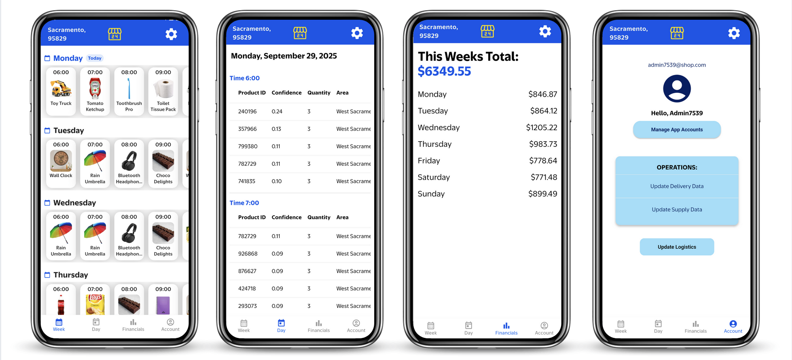

# Retail Analytics & Forecasting System

This repository contains a mobile application designed to support retail operations by integrating predictive analytics with a clean administrative interface. The app enables administrators to manage logistics, monitor financial performance, and utilize machine learning predictions to make informed operational decisions.

## Overview

The application consists of:
- **Frontend:** Developed in Flutter with local persistence using `sqflite`.
- **Backend:** Implemented with `FastAPI` for RESTful APIs and integration with machine learning models.
- **Machine Learning Models:** A hybrid ensemble that leverages `LightGBM` and two `neural networks` (Keras) for prediction tasks.

The system predicts:
1. Top-5 ranked products.
2. Estimated order quantity.
3. Delivery area (for internal use).
4. Estimated revenue for the next 7 days.

## Features

- **Account Management:** Admins can manage application accounts and update logistics operations.
- **Operations Management:** Update delivery data, supply data, and logistics.
- **Financial Tracking:** Monitor daily and weekly financial totals with clear breakdowns.
- **Prediction Integration:** View predicted top products and order quantities.
- **Scheduling View:** Daily and weekly product predictions displayed in a structured calendar-like view.

## Machine Learning Details

The `predict_top5()` function forms the core of the ML pipeline. It combines three models:

- **LightGBM:** Provides a ranking of the top-5 products.
- **Quantity Neural Network (Quantity NN):** A feedforward network predicting the order quantity for each product.
- **Multi-output Neural Network:** Predicts delivery areas (and additional product outputs, though the latter are unused in inference).

This ensemble improves the robustness of predictions by leveraging both gradient-boosting and deep learning models.

## Tech Stack

- **Frontend:** Flutter, sqflite
- **Backend:** FastAPI
- **Machine Learning:** LightGBM, Keras (TensorFlow backend)

## Screenshots

<p align="center">
  
</p>

## Installation and Setup

### Prerequisites
- [Flutter](https://flutter.dev/docs/get-started/install) installed and configured.
- Python 3.8+ with FastAPI and Uvicorn.
- Dependencies for machine learning models (LightGBM, TensorFlow/Keras).

### Backend Setup
```bash
# Navigate to backend directory
cd backend

# Run FastAPI server
uvicorn main:app --reload --port 8000
